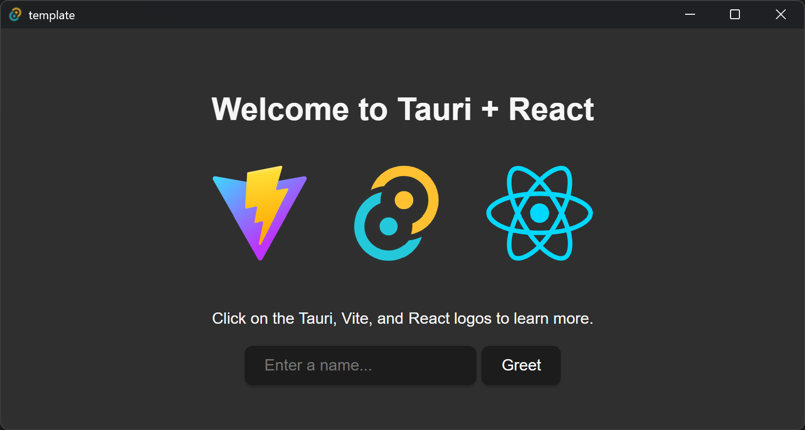

# Tauti_Rust_project_template
Rustを利用したGUIツール作成時のテンプレート

## 環境構築
### 必要なパッケージのインストール
初めてTauriを使った開発をする場合、以下をインストールする
* Node.jsのインストール

* Tauri CLIのインストール
```
cargo install tauri-cli
```

## プロジェクトの新規作成
```
npm create tauri-app

> npx
> create-tauri-app

✔ Project name · Template
✔ Package name · template
✔ Identifier · com.nanof.template
✔ Choose which language to use for your frontend · TypeScript / JavaScript - (pnpm, yarn, npm, deno, bun)
✔ Choose your package manager · npm
✔ Choose your UI template · React - (https://react.dev/)
✔ Choose your UI flavor · TypeScript

Template created! To get started run:
  cd Template
  npm install
  npm run tauri android init

For Desktop development, run:
  npm run tauri dev

For Android development, run:
  npm run tauri android dev
```

## アプリケーションのビルド・実行
### ローカルファイルのインストール
```
cd {ワークスペース}
npm install

added 71 packages, and audited 72 packages in 24s

11 packages are looking for funding
  run `npm fund` for details

found 0 vulnerabilities
```
### アプリケーションのビルド
```
cargo tauri dev
     Running BeforeDevCommand (`npm run dev`)

> template@0.1.0 dev
> vite


  VITE v7.1.1  ready in 641 ms

  ➜  Local:   http://localhost:1420/
     Running DevCommand (`cargo  run --no-default-features --color always --`)
        Info Watching C:\Users\nanof\WorkSpace\Tauri\Template\src-tauri for changes...
    Updating crates.io index
     Locking 492 packages to latest compatible versions
      Adding proc-macro-crate v2.0.0 (available: v2.0.2)
      Adding serialize-to-javascript v0.1.1 (available: v0.1.2)
      Adding serialize-to-javascript-impl v0.1.1 (available: v0.1.2)
  Downloaded cc v1.2.32
  Downloaded 1 crate (111.5 KB) in 13.83s
   Compiling proc-macro2 v1.0.95
   Compiling unicode-ident v1.0.18
   Compiling cfg-if v1.0.1
   ...
   Compiling tao v0.34.0
   Compiling webview2-com v0.38.0
    Finished `dev` profile [unoptimized + debuginfo] target(s) in 6m 29s
     Running `target\debug\template.exe`
```


## 配布用実行ファイルのビルド
### GUI(Frontend)のビルド
```
cd src-tauri
npm run build
```
Frontendのビルドを忘れると実行時にGUIが表示されない
### Rust(Backend)のビルド
```
cargo tauri build
```
ビルドされた実行ファイルは以下に出力される
```
src-tauri/target/release/output.exe
```

## リポジトリへcommit/push/mergeする前のワークスペースの整理
### ローカルファイルの削除
```
cd {ワークスペース}
rmdir /s dist
rmdir /s node_modules
```
### ビルド時の出力ファイル・中間ファイルの削除
```
cd src-tauri
cargo clean
```
以上を行ってからcommit/push/mergeすること
